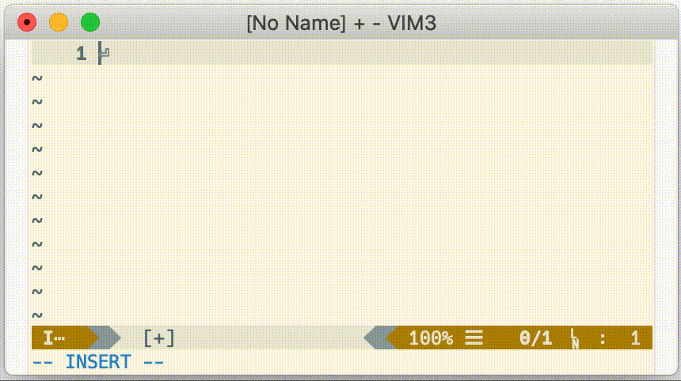

# asyncomplete-nextword.vim
Provides intelligent English autocomplete for asyncomplete.vim via nextword.

## Screenshot



## Installing

```
Plug 'prabirshrestha/asyncomplete.vim'
Plug 'prabirshrestha/async.vim'
Plug 'high-moctane/asyncomplete-nextword.vim'
```

You also need to install [Nextword](https://github.com/high-moctane/nextword) and
[Nextword-data](https://github.com/high-moctane/nextword-data).

### Registration

```vim
call asyncomplete#register_source(asyncomplete#sources#nextword#get_source_options({
            \   'name': 'nextword',
            \   'allowlist': ['*'],
            \   'args': ['-n', '10000'],
            \   'completor': function('asyncomplete#sources#nextword#completor')
            \   }))
```

Note: `args` is optional. it will be passed as the `nextword` arguments.

## Contributors

- high-moctane ([https://github.com/high-moctane](https://github.com/high-moctane))
- Rafael Bodill ([https://github.com/rafi](https://github.com/rafi))

## License

MIT

